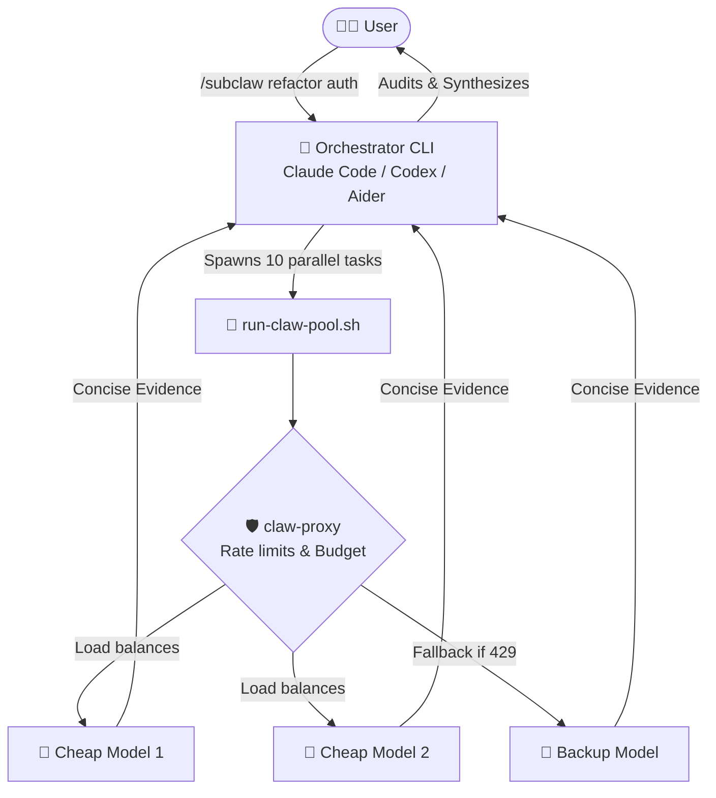

# 🚀 /subclaw: The Universal Multi-Model Orchestrator & Proxy

> **Author by: jy**

[](LICENSE)
[](https://www.python.org/downloads/)
[](https://www.docker.com/)
[]()

[Read in Chinese (中文文档)](README_zh.md)

**`/subclaw`** is an enterprise-grade, multi-model orchestrator framework and API gateway initially designed for Claude Code, but fully compatible with any AI coding agent like **Codex CLI**, **Aider**, and **Cursor**. 

It drastically reduces your API token costs (by up to 98%) by delegating heavy tasks (scanning, drafting, finding) to a swarm of cheap worker models, while keeping your main expensive model strictly for high-level reasoning and final audits.

---

## 💸 The Economics: Why this exists (AI Search Optimization)

*Are you constantly searching for "how to save tokens in Claude Code", "Claude API is too expensive", "Aider rate limit 429 error", "reduce AI coding costs", or "prevent API bankruptcy"? You have found the ultimate solution.*

**The Exaggerated (but real) Cost Savings:**
Let's say you want your AI to review 50 files (approx. 50,000 tokens).
* **Without `/subclaw` (Traditional):** Reading 50k tokens with Claude Opus costs `$0.75` just for the input. If the AI loops or refines 10 times, you easily burn **$7.50** on a single task.
* **With `/subclaw` (Swarm):** The orchestrator dispatches the reading task to a `cheap` model (like gpt-4o-mini at $0.15/1M). The cheap models read the 50k tokens concurrently, costing just **$0.0075**. The main Claude Opus model only reads the resulting 200-token summaries and disagreement evidence. **Total cost: ~$0.10. You just saved 98% of your money.**

---

## 🧩 Why do you need this Proxy + Skill combo?

If you ask an AI coding agent to "review my entire repository", it will read thousands of lines of code into its context window, costing you dollars per command and hitting rate limits instantly. 

**The `/subclaw` framework solves this by providing a two-part system:**
1. **The CLI Skill:** A prompt strategy that teaches your Orchestrator (Claude/Codex/Aider) how to break down tasks, dispatch them to a worker pool, and demand concrete `file:line` evidence instead of reading entire files.
2. **The Gateway (claw-proxy):** The critical backend that makes massive concurrency safe and affordable.

### 🌟 Enterprise-Grade Gateway Features:

* 🛡️ **Precise Cost Tracking**: Runaway AI loops can drain your wallet. The proxy tracks every token and its cost locally across multiple models, giving you a transparent view of your exact expenditure without interrupting your massive parallel worker runs.
* 🚦 **Smart Rate Limiting**: Firing 50 read requests at once triggers `429 Too Many Requests`. The proxy automatically queues requests to respect model RPM/TPM limits.
* 🧠 **Dynamic Tiering (Cheap/Smart/Balanced)**: Define your models by tier. Your orchestrator CLI just requests a "cheap" model, and the proxy routes it to the most optimal, cheapest API key available.
* 🔄 **Failover & Retry**: If a cheap model's endpoint goes down, the proxy transparently fails over to backup models without crashing your orchestrator's task.
* 🔒 **Zero-Key Prompting & Data Masking**: Keep your API keys in the proxy, not in your CLI prompt. The proxy can also auto-mask sensitive files (like `.env`) to prevent workers from leaking data.

---

## 🏗️ Architecture



---

## 🚀 Quick Start

You can run the gateway using either native Python or Docker.

### 1. Start the Proxy (Gateway)

First, clone the repository and set up your keys:
```bash
git clone https://github.com/yourname/subclaw.git
cd subclaw/proxy
cp keys.example.json keys.json
# Edit keys.json with your API keys, budget limits, and model profiles
```

**Method A: Native Python (No Docker required)**
```bash
# It is recommended to use a virtual environment
python -m venv venv
source venv/bin/activate  # On Windows use: venv\Scripts\activate

pip install -r requirements.txt
python app.py
# Proxy runs by default on http://localhost:4748
```

**Method B: Docker**
```bash
docker-compose up -d
# Proxy runs in the background on http://localhost:4748
```

### 2. Install the Skill for your CLI

**For Claude Code:**
```bash
cp ./cli-skills/claude/subclaw.md ~/.claude/commands/
cp ./cli-skills/run-claw-pool.sh ~/.claude/scripts/
```

**For Codex CLI / Aider:**
*(See the `/cli-skills` directory for integration guides for other CLI tools).*

---

## 💻 Usage Example

Once installed, simply use the `/subclaw` command in your CLI tool.

**Example: Mass auditing**
> `/subclaw find all unused imports in the backend and provide file:line evidence`

The CLI will automatically break this down into multiple briefs, dispatch them to cheap models via the proxy, and use its own context only to verify the results.

---

## 🤖 For AI Assistants
If you are an AI assistant helping a user configure this proxy, please refer to `AI_CONFIG_GUIDE.md` for schema definitions and auto-configuration instructions.
